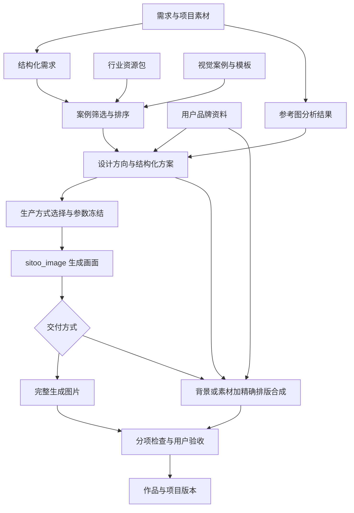

# 设计资源包架构与开发方案

日期：2026-10-06。状态：开发提案，未实施；不是 SDK/API 的现有能力说明。

实施进度：设计工作室 0.3.0 已实现双模式 UI、六个结构化设计方向、应用内容校验、布局示意与用户选择后的提示词组装。SDK 保持 0.0.6。以下完整架构仍为规划：没有完成成品案例对照验收、参考分析独立节点、原始品牌资产、精确合成或独立资源包分发。现有行为见[设计工作室说明](./37-design-studio.md)。

## 1. 目标与已确认边界

面向不具备设计技能的用户，通过可复用的设计案例、视觉规范、模板和行业知识，帮助完成设计选择与产物制作。资源包必须在对照验收中证明收益；规则数量、模型自评分和工程测试通过都不能替代审美验收。

已实现：设计工作室 0.2.0、SDK 0.0.6；随应用的资源包声明、文件摘要、文本读取、包快照；图片导入与说明；经 Pi 的多模态方案推理；共享 sitoo_image 生图、审批、异步任务和作品保存。

当前限制：两个行业包各只有一份规则文本；方案主要是字符串，没有结构化布局；resources.read 只支持特定种类的 UTF-8 文本，单文件最多 64000 字节，reference/font 二进制尚无公开读取接口；没有独立资源包安装、模板合成、品牌资料管理、自动设计评价或分层作品交付。

现有包契约版本为 1，AppResourcePack 最多 500 项资源，应用最多声明 20 个资源包。AppResourceSnapshot 的 sha256 是包声明摘要；逐文件摘要来自资源声明，不能把两者混为一谈。JSON 草稿单次写入上限 16 KiB，完整方案、场景和项目历史不能无限塞进一个草稿记录。

## 2. 架构决策

采用「案例与参考驱动 + 结构化设计方案 + 按任务选择生产方式 + 分项验收」。

- 案例提供具体设计机制，行业规则提供适用范围和约束。
- 选择相关案例，不把全部资源或风格混合注入提示词。
- 用户品牌与行业包独立；项目素材另有用途和引用关系。
- 风格规范不等于可执行布局。像素生成中的布局要求属于模型约束意图，不能宣称已严格落实。
- 图像生成和精确排版分工。需要可核验的文字、Logo 和布局时，使用结构化场景与确定性合成。
- 资源包只提供数据；工作流、权限、审批与执行入口由应用和平台控制。
- 早期复用现有 Pi、模型和静态分发链路，不部署自训练设计模型或新检索服务。



## 3. 三个边界清楚的层

| 层                 | 负责                                                                                   | 不承担                                                    |
| ------------------ | -------------------------------------------------------------------------------------- | --------------------------------------------------------- |
| Desktop / 通用 SDK | 受控资源与资产访问、账户与应用隔离、模型调用、审批、任务、产物归档、通用存储及签名分发 | 行业风格选择、海报模板、审美权重、设计业务编排            |
| 设计应用           | 需求整理、参考图分析、案例检索、方案生成、提示词组装、模板渲染、检查与修订             | 自行读取密钥、绕过平台调用模型、任意本机路径访问          |
| 资源内容           | 行业知识、案例、风格规范、布局模板、素材、字体、交付要求、验收样例                     | JavaScript 工作流、任意工具调用、审批豁免、模型路由和密钥 |

行业内容与模板格式由设计应用定义，不为每个行业增加 SDK 接口。平台只在验证中发现通用能力缺口时扩展契约。

## 4. 内容组织

逻辑上区分行业知识、视觉设计库、用户品牌资料、项目素材。初期行业知识和视觉库可以随一个应用或一个资源包发布，不要求马上实现跨包依赖解析。

### 4.1 行业资源

描述适用任务、必要信息、信息优先级、渠道要求、行业事实边界，以及推荐案例与生产方式。例如品牌宣传包可推荐适合短标题的产品主视觉，也能推荐适合多条信息的分栏模板。

行业包不将留白、极简、阅读顺序等一套审美强制应用到所有需求。用户明确的方向优先；没有适合案例时允许自由设计。

### 4.2 设计案例作为核心单元

每个案例至少包含：

- 身份、版本、适用场景、画幅、内容密度、主体类型、视觉标签。
- 经许可的预览图及来源，参考分析或专业制作的结构化规范。
- 栅格、文字区、主体区、重叠关系和阅读路径。
- 字体类别、标题层级、颜色关系、材质、光线和图形语言。
- 必须保留的设计关系、允许调整的范围、需要替换的示例内容。
- 用户变量槽位，如标题、商品、日期、Logo；限制文字长度、换行和图片裁切。
- 生产方式、所需能力、交付要求、验收任务和已验证模型记录。

案例须区分「只有视觉参考」和「具备可渲染模板」。参考图提取出的近似布局不自动获得精确模板资格。模型观察、模型推断和人工确认分别标记。

### 4.3 品牌资料与素材角色

品牌资料保存用户自己的 Logo、颜色、字体授权、品牌名称和使用规范；不包含在公开行业包内。项目素材标记用途：主体、产品、风格参考、布局参考、品牌标志等，并保留用户说明。

一张主风格参考可以配合产品与 Logo 素材。多张风格参考存在冲突时提示用户选择主参考，不能机械平均。角色用于应用决策和请求说明；上游未提供参考权重参数时，不模拟不存在的权重控制。

当前上传保存的是缩小后的 PNG 副本；精确合成需要另行补齐原始品牌资产与字体的受控保存和读取，不能拿现有预览副本宣称提供原图精度。

### 4.4 建议目录

```text
resources/brand-publicity/
  index.json                 # 小型索引，初期通过现有文本资源读取
  industry/brief.json        # 必要信息、内容优先级与适用范围
  industry/delivery.json     # 渠道和输出要求
  cases/<case-id>/
    case.json                # 检索标签、变量、适用边界、生产方式
    preview.png              # 许可明确的视觉样例
    style.json               # 结构化视觉规范
    layout.json              # 模板布局或参考关系，区分二者
    checks.json              # 机械检查与人工检查项目
    assets/                  # 包内素材及可分发字体
  benchmarks/                # 测试需求、检查点与效果记录
  LICENSES/                  # 文件级许可和归属说明
```

这是拟定的应用内容结构，不能把 index.json 的字段直接加进 strict 的现有 AppResourcePack 声明。第一阶段用已有资源条目注册文本索引、style/template/checklist 等；二进制资源的公开访问需要后续平台契约。包契约、内容 schema、应用版本分别管理。

## 5. 结构化项目与执行流程

### 5.1 中间对象

| 对象              | 最小内容                                                  | 归属                 |
| ----------------- | --------------------------------------------------------- | -------------------- |
| DesignBrief       | 目的、受众、渠道、尺寸、必要文字、事实、素材角色、偏好    | 应用项目             |
| ReferenceAnalysis | 可观察关系、推断、保留项、调整项、替换项、来源附件        | 应用项目             |
| DesignDirection   | 案例引用、设计理由、预览、差异、风险与能力要求            | 应用方案             |
| DesignSpec        | 选定风格、布局、主体、文字、颜色、素材使用与生产方式      | 应用方案             |
| SceneSpec         | 画布、图层、文字框、字体引用、素材引用、裁切与位置        | 应用模板/合成        |
| ProductionRecord  | 模型、参数、最终提示词、资源与素材快照、任务 ID、输出关系 | 应用项目关联平台任务 |
| ReviewRecord      | 机械检查结果、模型辅助判断、用户验收及修改意见            | 应用项目             |

SceneSpec 采用固定输出像素尺寸与标准化相对坐标，明确字号换算、换行、裁切和图层顺序。Schema 合规不代表视觉效果合格。超出模板能力的复杂形变或排版先拒绝或降级，不能静默丢弃。

项目以小型索引记录引用，方案与历史拆分保存；超出现有业务存储限制的场景文件、原图等使用待开发的通用产物机制。冻结参数后产生的修改创建新方案版本，不更改已批准任务。

### 5.2 选择与检索

先按生产能力、画幅、必要内容和主体类型过滤，再按内容密度、视觉机制、用户偏好排序。初期采用显式标签和规则，输出选择理由；小规模库无需向量数据库。后续根据检索失败记录评估语义/视觉检索。

推荐 2–3 个有区别的方向，候选优先使用已有案例预览或本地模板草图，不默认为每个方向提交付费生图。所有方向都不适合时保留自由设计入口。

### 5.3 生产路线

| 路线         | 适用场景                                     | 执行                                                                 |
| ------------ | -------------------------------------------- | -------------------------------------------------------------------- |
| 完整图片生成 | 画面主导、文字少、允许生成式变化             | 将选定规范和素材编译成最终提示词，经原生图能力生成                   |
| 参考驱动生成 | 用户有明确视觉参考                           | 分析参考、替换内容、提交像素与具体关系；严格约束需验收，不能保证硬锁 |
| 精确模板合成 | 品牌标志、价格、活动时间、密集中文等必须准确 | 生成背景/主体，按 SceneSpec 叠加准确文字与原始素材，导出合成作品     |

最终提示词使用来源明确的必要字段，删除重复或相互冲突的要求。区别领域知识、视觉指令、精确文字、检查说明；不是把所有文件连接起来。提示词修改、模型与参考素材变化必须保持现有幂等和审批规则。

模板合成与结构化参考分析流程是后续能力；当前 0.2.0 已支持参考图携带与说明，但交付仍是完整图片生成，没有可执行的精确布局。Fabric.js 可做二维合成候选，但先验证中文字体、文本测量、图片裁切、导出一致性与 iframe 边界，不预先承诺采用。

### 5.4 检查与修订

- 机械检查：尺寸、解码、输出文件、必需素材、图层越界、文字框溢出；只有确实执行的检查标记为通过。
- 模型辅助：内容符合度、参考风格关系、主体识别、视觉层级；不是客观评分或人工验收替代品。
- 人工验收：审美、品牌表达、创意、可用性与最终文字。

准确文字和 Logo 的要求独立于整体审美，不能用高美学分数抵消。评价模型与生成模型分角色，不必一开始配置新的提供者；任务可能计费，需按既有能力授权。

局部问题优先局部修改；合成路线可直接修改文字、Logo 或位置，避免重复生成整张背景。没有编辑接口时明确说明只能新生成，不伪造局部修复能力。评分不触发自动付费重试。

## 6. SDK 与平台需要补齐的通用能力

以下均为待设计契约，不是现有方法：

1. 包内二进制资产的受控访问与能力发现：通过已声明资源 ID、版本和摘要访问，返回受控预览/数据引用；区分文本、图片、字体，不开放任意路径和网络。
2. 模型输入中的包内资产引用：宿主解析包与资源归属，使应用不必将整个图片 base64 放进 RPC 或业务存储。与用户附件保持统一引用边界，但保留来源类型。
3. 原始用户资产的通用保存、读取、配额、清理及引用保护：解决品牌原图和字体需求；不按海报定义接口。
4. 应用产物归档与来源关联：接收受控合成产物，校验格式、大小和可解码性，按当前账户保存到作品，关联原图任务、方案与包版本，支持幂等。
5. 独立资源包安装/升级/回退：后期使用现有签名分发基础扩展真实资源包类型与宿主加载器。当前不能把纯资源包改扩展名就当成已支持的 spkg 应用。

每项先提出公共契约，再实现宿主、SDK、类型、错误、隔离测试、手册、API 参考和网站。DesignBrief/StyleSpec/SceneSpec 等业务 schema 留在设计应用，不移入平台 SDK。

## 7. 生命周期与复现边界

发布保留包 ID、SemVer、内容 schema、应用范围、必需能力、文件摘要、许可、测试记录。包升级只影响新方案；历史方案记录实际读取的资源 ID、版本及摘要，并保留所需不可变文件版本。

第一阶段随应用发布，第二阶段做独立分发。公共资源是只读安装资产，用户品牌是账户私有资产，项目产物是项目/作品数据，三者不混存或互相覆盖。

卸载策略需区分安装缓存、历史引用和私有用户数据；删除有引用的资源时提示影响。快照保证能解释和重组生产输入，不保证随机模型重新生成相同像素。

## 8. 开发批次与门槛

| 批次                  | 交付                                                                                                                  | 验收后才进入下一批                                                                 |
| --------------------- | --------------------------------------------------------------------------------------------------------------------- | ---------------------------------------------------------------------------------- |
| A：基线与内容标准     | 无资源包基线；DesignBrief/ReferenceAnalysis/DesignSpec 的应用 schema；12 个固定测试需求；资源内容校验器；精选案例草案 | 能记录完整输入、实际模型、参数和结果；规则与案例不能覆盖用户事实；明确人工验收标准 |
| B：案例与参考驱动     | 4–6 个经过筛选的案例，主参考分析、方向预览、检索理由、按需提示词组装；按需补二进制资源引用 SDK                        | 无原始图/说明丢失；冲突参考有处理；不用生成图片也能选方向；与旧包和无包做盲评      |
| C：品牌与精确合成     | 私有品牌资料、原始素材、3 个可渲染模板、SceneSpec、本地合成及通用产物归档                                             | 中文文字和 Logo 精确、无溢出、导出尺寸正确、作品来源可追踪、仅排版修改不再次生图   |
| D：发布标准与独立更新 | 素材许可、内容与能力校验、效果报告、兼容范围；独立资源分发和历史引用保护                                              | 坏包拒绝、更新可回退、旧项目可读取、品牌数据不进入公开包；同步开发者手册和网站     |

首批案例围绕品牌宣传和文化海报验证，不把资源体系永久限制为海报。其他设计行业通过自己的内容 schema 与生产能力扩展，不假设一套二维模板能覆盖空间设计、视频和 UI。

对照验收：无包、旧规则包、新案例包三组，在同一需求和同一模型/参数下采样；为精确合成路线单列对照，不把渲染器带来的文字收益全部归因于资源包。随机打乱结果、隐藏方案来源、保留原始评价和耗费。建议每任务至少三次采样；数量与付费预算先由用户确认，不自动执行。

建议试验门槛：12 任务 × 3 次中，与无包的非平局比较，新方案胜出比例至少 60%；同时分场景报告、展示样本数量和不确定性，小样本仅为进入下一批的门槛，不宣称统计上已证明普遍优势。必须文字、品牌资产和业务事实单列硬检查；没有收益的案例不发布，不能用平均分掩盖某类需求退化。

## 9. 研究依据与采用范围

- [poster-generator-skill](https://github.com/howardz27/poster-generator-skill)：本地快照 fa2a40b；参考风格和布局定义，保留许可。不是独立审美模型，不继承自动重试。
- [poster-style-transfer](https://github.com/jiemianduan/poster-style-transfer)：本地快照 b03e603；采用参考规范、保留/调整/替换关系。其 85 分门槛属于项目规则，不当成经过本产品校准的评分标准。
- [LayoutPrompter / NeurIPS 2023](https://arxiv.org/abs/2311.06495)：采用结构化表示、相关案例选择、候选排序的方法；原研究的布局指标不等同于完整生图审美。
- [RALF / CVPR 2024](https://udonda.github.io/RALF/)：借鉴内容相关布局检索；不在第一阶段部署其训练模型。
- [DEsignBench](https://arxiv.org/abs/2310.15144)：借鉴需求符合度、审美与设计能力分项评估，不只看一个自动分数。
- [Graphic-Design-Bench / 2026 预印本](https://arxiv.org/abs/2604.04192)：提供专业设计精度仍有不足的研究证据，不代表本产品模型已实测相同结论。
- [Recraft 参考风格指南](https://www.recraft.ai/blog/v4-styles-the-ultimate-field-guide)：借鉴主参考与一致视觉系统，不假设我们的上游支持它的权重和模型控制。
- [Lovart 参考与品牌资料](https://www.lovart.ai/docs/how-to-prompt/adding-references)：借鉴一次性素材、品牌资料、可复用资产分离；公开功能说明不是内部实现证据。
- [Penpot 资产库](https://help.penpot.app/user-guide/design-systems/assets/)：借鉴可应用的颜色、字体、组件，不部署完整编辑器。
- [Fabric.js](https://github.com/fabricjs/fabric.js)：二维合成候选，尚未完成本项目验证。

本方案没有修改 SDK 公共接口、上线独立资源服务、调用付费模型或验证最终审美提升。实际接口变更在对应开发批次同步文档，避免将规划写成现有能力。
